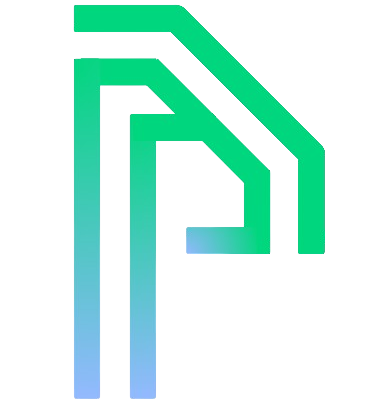

<link rel="preconnect" href="https://fonts.googleapis.com">
<link rel="preconnect" href="https://fonts.gstatic.com" crossorigin>
<link href="https://fonts.googleapis.com/css2?family=Raleway:wght@100&family=Tangerine:wght@700&display=swap" rel="stylesheet">
<link rel="stylesheet" href="style.css">

    

        <h1 style="color: white;">
            
            &nbsp;PIOTR SOBOL&nbsp;
        </h1>
    

<h3 style="font-family: cursive">Hi there, I'm Pyother</h3>

My name is Piotr Sobol. I'm web developer with great passion for electronics and embedded systems.

My services:

* Websites - creation, management and development. 
* Applications for IoT home automations. 

Official website: https://about.pyother.pl

Keep in touch! 

